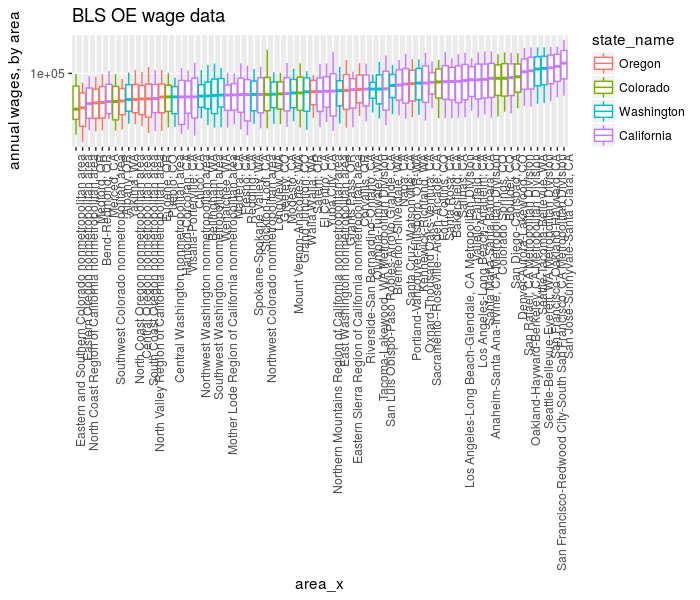
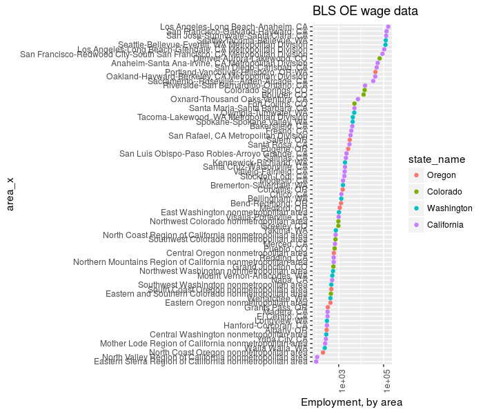
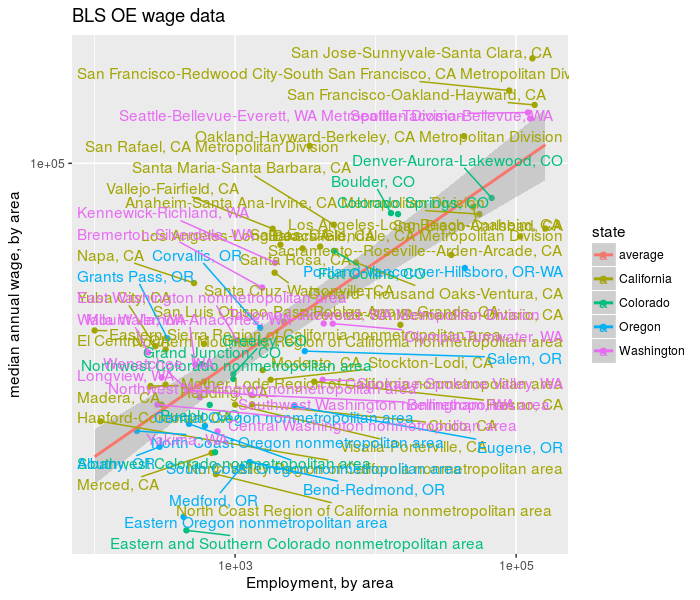

# BLS OE data

Here we load BLS OE (employment and wage) data into a sqlite database.


```r
library(dplyr)
con <- src_sqlite("bls.sqlite")

# I am looking for a few states
mystates <- tbl(con, "area") %>% filter(areatype_code == 
    "S") %>% collect(n = Inf) %>% filter(grepl("California|Oregon|Washington|Colorado", 
    area_name)) %>% rename(state_name = area_name)

library(ggplot2)
library(forcats)


nerds <- tbl(con, "occupation") %>% filter(occupation_name %like% 
    "Computer%") %>% filter(display_level == 0) %>% 
    select(occupation_code, occupation_name) %>% inner_join(tbl(con, 
    "wages"), by = "occupation_code") %>% select(-year, 
    -period, -footnote_codes, -seasonal, -industry_code) %>% 
    inner_join(tbl(con, "area"), by = c("area_code", 
        "areatype_code")) %>% inner_join(tbl(con, "areatype"), 
    by = c("areatype_code")) %>% collect(n = Inf)

ph <- nerds %>% inner_join(mystates %>% select(state_code, 
    state_name), by = c("state_code")) %>% filter(grepl("Metropolitan", 
    areatype_name)) %>% mutate(area_x = forcats::fct_reorder(factor(area_name), 
    annual_wage_qtile_50)) %>% mutate(state_name = forcats::fct_reorder(factor(state_name), 
    annual_wage_qtile_50)) %>% ggplot(aes(area_x, y = annual_wage_mean, 
    middle = annual_wage_qtile_50, upper = annual_wage_qtile_75, 
    lower = annual_wage_qtile_25, ymax = annual_wage_qtile_90, 
    ymin = annual_wage_qtile_10, color = state_name)) + 
    geom_boxplot(stat = "identity") + scale_y_log10() + 
    theme(axis.text.x = element_text(angle = 90, hjust = 1)) + 
    labs(y = "annual wages, by area", title = "BLS OE wage data")
print(ph)
```



```r
emply <- tbl(con, "occupation") %>% filter(occupation_name %like% 
    "Computer%") %>% filter(display_level == 0) %>% 
    select(occupation_code, occupation_name) %>% inner_join(tbl(con, 
    "employment"), by = "occupation_code") %>% select(-year, 
    -period, -footnote_codes, -seasonal, -industry_code) %>% 
    inner_join(tbl(con, "area"), by = c("area_code", 
        "areatype_code")) %>% inner_join(tbl(con, "areatype"), 
    by = c("areatype_code")) %>% collect(n = Inf)

ph <- emply %>% inner_join(mystates %>% select(state_code, 
    state_name), by = c("state_code")) %>% filter(grepl("Metropolitan", 
    areatype_name)) %>% mutate(area_x = forcats::fct_reorder(factor(area_name), 
    Employment)) %>% mutate(state_name = forcats::fct_reorder(factor(state_name), 
    Employment)) %>% ggplot(aes(area_x, Employment, 
    color = state_name)) + geom_point() + scale_y_log10() + 
    theme(axis.text.x = element_text(angle = 90, hjust = 1)) + 
    coord_flip() + labs(y = "Employment, by area", 
    title = "BLS OE wage data")
print(ph)
```



```r
both <- emply %>% inner_join(nerds)

library(ggrepel)
ph <- both %>% inner_join(mystates %>% select(state_code, 
    state_name), by = c("state_code")) %>% filter(grepl("Metropolitan", 
    areatype_name)) %>% mutate(area_x = forcats::fct_reorder(factor(area_name), 
    Employment)) %>% mutate(state_name = forcats::fct_reorder(factor(state_name), 
    Employment)) %>% ggplot(aes(Employment, annual_wage_qtile_50, 
    label = area_name, color = state_name)) + geom_point() + 
    scale_x_log10() + scale_y_log10() + stat_smooth(method = "lm", 
    aes(color = "average")) + geom_text_repel() + labs(color = "state", 
    x = "Employment, by area", y = "median annual wage, by area", 
    title = "BLS OE wage data")
print(ph)
```



