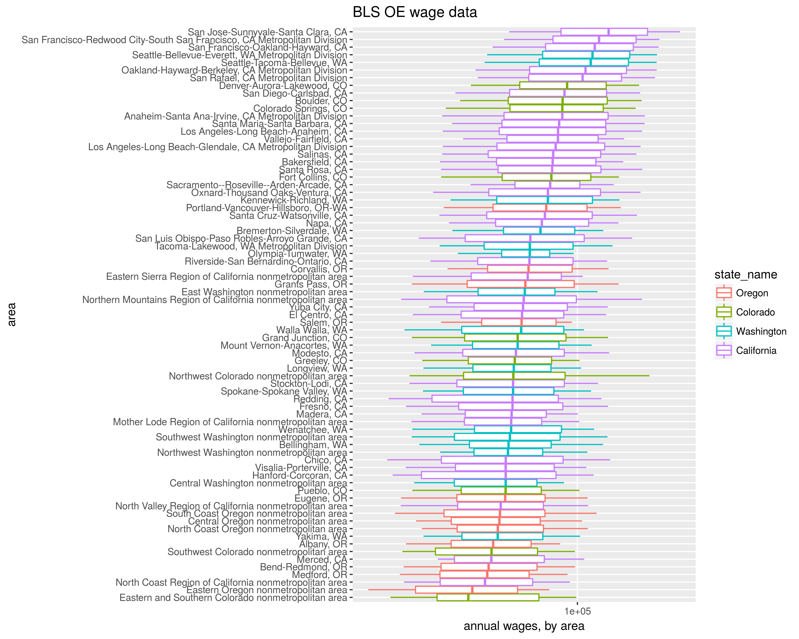
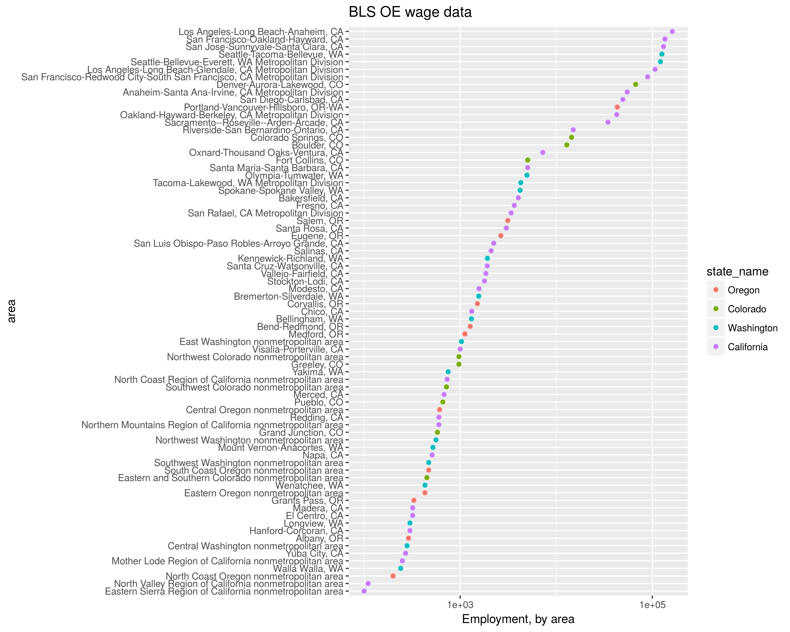
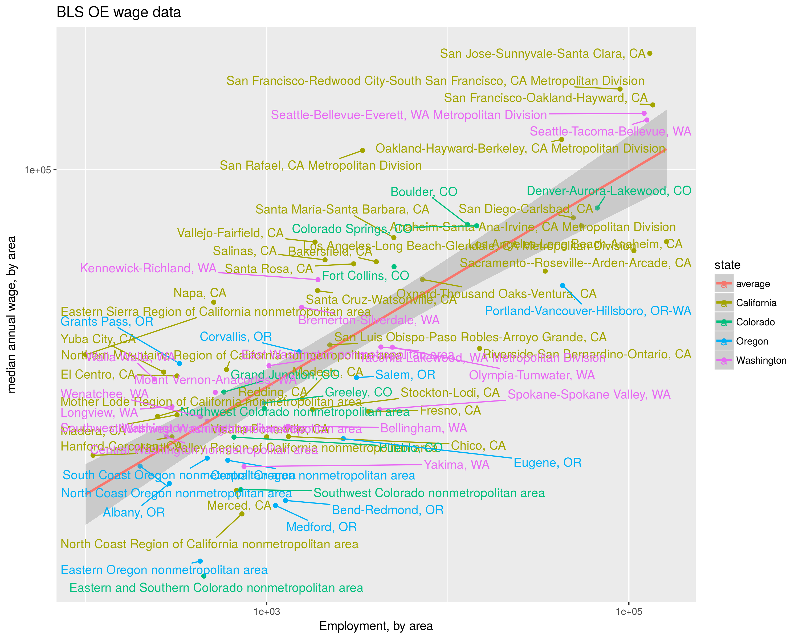

# BLS OE data

Here we load BLS OE (employment and wage) data into a sqlite database. The
Makefile simplifies processing


```bash
make help
```

```
## make[1]: Entering directory '/home/spav/github/bls_oe'
## bls_files                      download all the BLS files
## help                           generate this help message
## readme                         make the README.md file
## sqlite                         stuff into a sqlite file
## make[1]: Leaving directory '/home/spav/github/bls_oe'
```

```bash
make -B -n sqlite
```

```
## make[1]: Entering directory '/home/spav/github/bls_oe'
## mkdir -p download.bls.gov/pub/time.series/oe
## wget -O download.bls.gov/pub/time.series/oe/oe.area https://download.bls.gov/pub/time.series/oe/oe.area
## wget -O download.bls.gov/pub/time.series/oe/oe.areatype https://download.bls.gov/pub/time.series/oe/oe.areatype
## wget -O download.bls.gov/pub/time.series/oe/oe.contacts https://download.bls.gov/pub/time.series/oe/oe.contacts
## wget -O download.bls.gov/pub/time.series/oe/oe.data.0.Current https://download.bls.gov/pub/time.series/oe/oe.data.0.Current
## wget -O download.bls.gov/pub/time.series/oe/oe.datatype https://download.bls.gov/pub/time.series/oe/oe.datatype
## wget -O download.bls.gov/pub/time.series/oe/oe.footnote https://download.bls.gov/pub/time.series/oe/oe.footnote
## wget -O download.bls.gov/pub/time.series/oe/oe.industry https://download.bls.gov/pub/time.series/oe/oe.industry
## wget -O download.bls.gov/pub/time.series/oe/oe.occupation https://download.bls.gov/pub/time.series/oe/oe.occupation
## wget -O download.bls.gov/pub/time.series/oe/oe.release https://download.bls.gov/pub/time.series/oe/oe.release
## wget -O download.bls.gov/pub/time.series/oe/oe.seasonal https://download.bls.gov/pub/time.series/oe/oe.seasonal
## wget -O download.bls.gov/pub/time.series/oe/oe.sector https://download.bls.gov/pub/time.series/oe/oe.sector
## r stuffit.R -D download.bls.gov/pub/time.series/oe -O bls.sqlite
## make[1]: Leaving directory '/home/spav/github/bls_oe'
```

## Some data

Look. data.


```r
library(dplyr)
con <- src_sqlite('bls.sqlite')

# I am looking for a few states
mystates <- tbl(con,'area') %>% 
	filter(areatype_code=='S') %>% 
	collect(n=Inf) %>%
	filter(grepl('California|Oregon|Washington|Colorado',area_name)) %>%
	rename(state_name=area_name)

library(ggplot2)
library(forcats)


nerds <- tbl(con,'occupation') %>%
	filter(occupation_name %like% 'Computer%') %>%
	filter(display_level==0) %>%
	select(occupation_code,occupation_name) %>%
	inner_join(tbl(con,'wages'),by='occupation_code') %>%
	select(-year,-period,-footnote_codes,-seasonal,-industry_code) %>%
	inner_join(tbl(con,'area'),by=c('area_code','areatype_code')) %>%
	inner_join(tbl(con,'areatype'),by=c('areatype_code')) %>%
	collect(n=Inf)

ph <- nerds %>% 
	inner_join(mystates %>% select(state_code,state_name),by=c('state_code')) %>%
	filter(grepl('Metropolitan',areatype_name)) %>%
	mutate(area_x=forcats::fct_reorder(factor(area_name),annual_wage_qtile_50)) %>%
	mutate(state_name=forcats::fct_reorder(factor(state_name),annual_wage_qtile_50)) %>%
	ggplot(aes(area_x,
						 y=annual_wage_mean,
						 middle=annual_wage_qtile_50,
						 upper=annual_wage_qtile_75,
						 lower=annual_wage_qtile_25,
						 ymax=annual_wage_qtile_90,
						 ymin=annual_wage_qtile_10,
						 color=state_name)) + 
	geom_boxplot(stat='identity') + 
	scale_y_log10() + 
	coord_flip() +
	labs(x='area',
			 y='annual wages, by area',
			 title='BLS OE wage data')
print(ph)
```



```r
emply <- tbl(con,'occupation') %>%
	filter(occupation_name %like% 'Computer%') %>%
	filter(display_level==0) %>%
	select(occupation_code,occupation_name) %>%
	inner_join(tbl(con,'employment'),by='occupation_code') %>%
	select(-year,-period,-footnote_codes,-seasonal,-industry_code) %>%
	inner_join(tbl(con,'area'),by=c('area_code','areatype_code')) %>%
	inner_join(tbl(con,'areatype'),by=c('areatype_code')) %>%
	collect(n=Inf)

ph <- emply %>%
	inner_join(mystates %>% select(state_code,state_name),by=c('state_code')) %>%
	filter(grepl('Metropolitan',areatype_name)) %>%
	mutate(area_x=forcats::fct_reorder(factor(area_name),Employment)) %>%
	mutate(state_name=forcats::fct_reorder(factor(state_name),Employment)) %>%
	ggplot(aes(area_x,Employment,color=state_name)) + 
	geom_point() + 
	scale_y_log10() + 
	coord_flip() +
	labs(x='area',
			 y='Employment, by area',
			 title='BLS OE wage data')
print(ph)
```



```r
both <- emply %>% 
	inner_join(nerds)

library(ggrepel)
ph <- both %>%
	inner_join(mystates %>% select(state_code,state_name),by=c('state_code')) %>%
	filter(grepl('Metropolitan',areatype_name)) %>%
	mutate(area_x=forcats::fct_reorder(factor(area_name),Employment)) %>%
	mutate(state_name=forcats::fct_reorder(factor(state_name),Employment)) %>%
	ggplot(aes(Employment,annual_wage_qtile_50,
						 label=area_name,
						 color=state_name)) + 
	geom_point() + 
	scale_x_log10() + scale_y_log10() + 
	stat_smooth(method='lm',aes(color='average')) + 
	geom_text_repel() + 
	labs(color='state',
			 x='Employment, by area',
			 y='median annual wage, by area',
			 title='BLS OE wage data')
print(ph)
```



# Legal Mumbo Jumbo

The `bls_oe` processing code is free software: you can redistribute it and/or modify
it under the terms of the GNU Lesser General Public License as published by
the Free Software Foundation, either version 3 of the License, or
(at your option) any later version.

`bls_oe` is distributed in the hope that it will be useful,
but WITHOUT ANY WARRANTY; without even the implied warranty of
MERCHANTABILITY or FITNESS FOR A PARTICULAR PURPOSE.  See the
GNU Lesser General Public License for more details.

You should have received a copy of the GNU Lesser General Public License
along with fromo.  If not, see <http://www.gnu.org/licenses/>.

